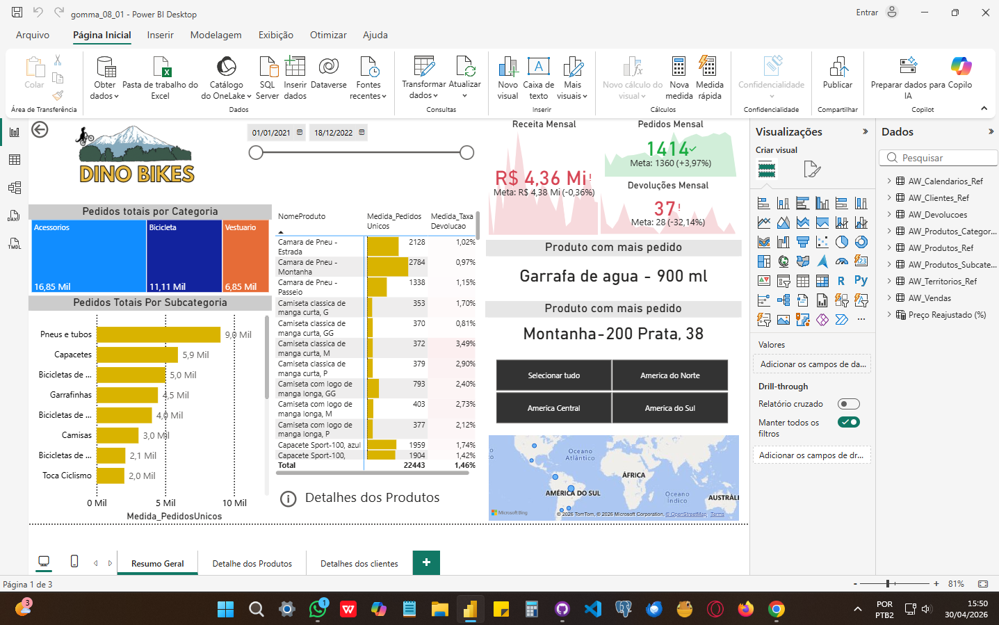
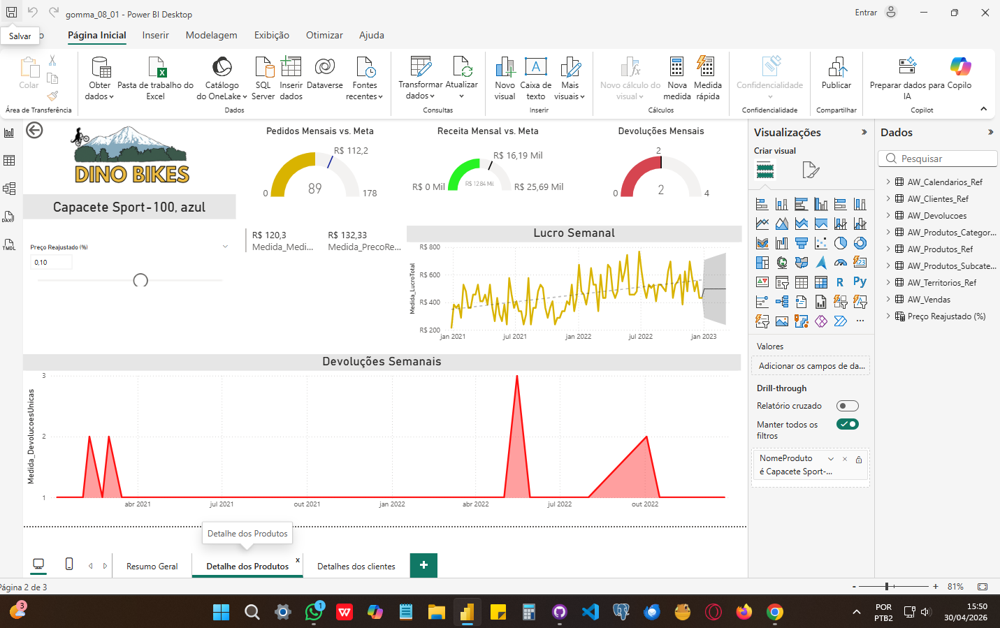
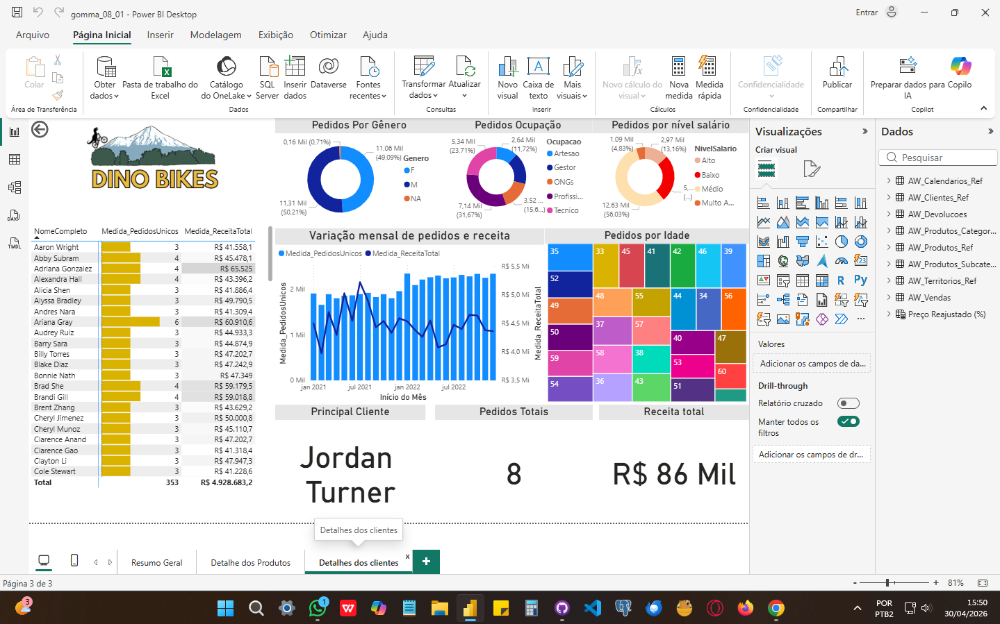

# 📊 Dashboard de Vendas - Dino Bikes (Power BI)

## 📌 Sobre o Projeto
Este projeto apresenta um dashboard desenvolvido no Power BI com foco na análise de vendas da empresa fictícia **Dino Bikes**.

O objetivo é fornecer insights sobre performance comercial, comportamento de clientes e evolução dos indicadores ao longo do tempo.

---

## 🎯 Principais Análises

- KPIs de vendas: receita, pedidos e devoluções
- Comparação de metas vs realizado
- Análise por categoria, subcategoria e produto
- Identificação de produtos mais vendidos
- Análise temporal (mensal e semanal)
- Segmentação de clientes por:
  - Gênero
  - Idade
  - Ocupação
  - Nível salarial
- Identificação de cliente destaque
- Análise geográfica por região
- Navegação interativa com filtros e drill-down

---

## 📊 Ferramentas Utilizadas

- Power BI
- DAX
- Modelagem de dados

---

## 📁 Arquivo do Projeto

- `gomma_08_01.pbix`

---

## 📷 Visão do Dashboard

## 📷 Visão do Dashboard

### 📊 Resumo Geral

---

### 📦 Detalhes dos Produtos

---

### 👥 Detalhes dos Clientes

---

## 🚀 Objetivo

Demonstrar habilidades em:
- Análise de dados
- Criação de dashboards
- Construção de KPIs
- Storytelling com dados

---

## 👨‍💻 Autor

Ryan
